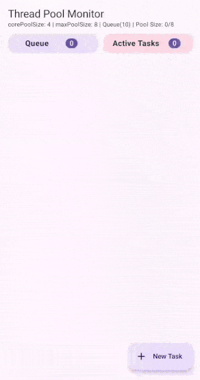

Kotlin coroutines enables us to write asynchronous code in a sequential way with help of suspend functions. This is possible because Kotlin compiler transforms our code and uses Continuation-Passing Style (CPS) and complex state machines. Similarly there is popular statement that `We can run millions of coroutines, but not millions of threads`. Thread pool and ThreadPoolExecutors play an important role in achieving this.  
In Java threads can be created using two ways
### By implementing the Runnable interface
The Runnable interface defines a single method, run, meant to contain the code that should be executed in the thread. Create an instance of class that implements java.lang.Runnable interface. Create a new Thread object by passing this runnable instance to the Thread constructor . Call the start() method on the Thread object to start a new Thread. 

```java
public class MyRunnableTask implements Runnable {
    @Override
    public void run() {
        System.out.println("Hello from Thread");
    }

    public static void main(String[] args) {
        Thread thread = new Thread(new MyRunnableTask());
        thread.start();
    }
}
```
### By extending the Thread class:
The Thread class itself implements Runnable, but its run method has no implementation. So Create a class that extends java.lang.Thread and override run() method and have code inside this run method that should be executed in a thread. Create instance of this custom thread class and call the start() method on it to start a new Thread. 
```java
public class SimpleThread extends Thread {

    public void run() {
        System.out.println("Hello from Thread");
    }

    public static void main(String[] args) {
        SimpleThread thread = new SimpleThread();
        thread.start();
    }

}
```

This way we can create Threads for simple async tasks. But in concurrent programming, when we need to create several threads, and manage them, Java's Executors will be helpful. 
### Executors
Executors define a high-level API for launching and managing threads automatically and also reuses threads using thread pool. 
There are three executor interfaces in java.util.concurrent package.
- Executor
- ExecutorService
- ScheduledExecutorService
##### Executor Interface
Executor Interface has only one method execute. This execute method has Runnable object as parameter. Depending on how the Executor is implemented, the execute method may simply create a new thread with a Runnable object and start the thread, use an existing thread to run the Runnable object, or place the Runnable object in a queue to wait for a thread to become available.
##### ExecutorService Interface
ExecutorService is an interface that extends Executor interface. It provides submit() method which accepts Runnable object as parameter similar to execute method . But apart from this it also accepts Callable objects, which allow the task to return a value. The return type of submit method is Future object (Future<String>, Future<Integer>, etc.) which can be used to retrieve the return value of Callable and to manage the status of Callable.  
When Runnable object is submitted to the ExecutorService using the submit() method, it returns a Future object without result (Future<?>), but can be used to manage the status of Runnable task. 
```java
import java.util.concurrent.*;

public class ExecutorServiceExample {
    public static void main(String[] args) throws InterruptedException, ExecutionException {
        // Create a thread pool with 2 threads
        ExecutorService executor = Executors.newFixedThreadPool(2);

        Runnable runnableTask = new Runnable() {
            @Override
            public void run() {
                System.out.println("Runnable task is running.");
            }
        };
        // Submit a Runnable task (does not return a result)
        Future<?> runnableFuture = executor.submit(runnableTask);

        Callable<String> callableTask = new Callable<String>() {
            @Override
            public String call() throws Exception {
                return "Callable task result";
            }
        };
        // Submit a Callable task (returns a result)
        Future<String> future = executor.submit(callableTask);
        String result = future.get(); // blocks until result is available
        System.out.println("Result from Callable: " + result);
        executor.shutdown();
    }
}
```

##### ScheduledExecutorService
ScheduledExecutorService is an interface that extends ExecutorService interface. ScheduledExecutorService provides schedule() method which accepts Runnable or Callable task objects that runs after a specified delay.  
  
<sub><i>Relationship between different executors in java.util.concurrent package</i></sub>
### ThreadPoolExecutor
Each thread object consumes significant amount of memory and thread creation is a overhead. If we have many asynchronous tasks, then creating a new thread of each task is not a optimal solution. Most Executor implementations in java.util.concurrent package uses thread pool containing worker threads which are reused.  
In this blog we are going to learn about ThreadPoolExecutor which is one of the commonly used implementations of ExecutorService.  
ThreadPoolExecutor effectively manages a pool of worker threads to execute tasks submitted to the queue.  
Following is the constructor and parameters to create a ThreadPoolExecutor  
```java
public ThreadPoolExecutor(int corePoolSize,
                          int maximumPoolSize,
                          long keepAliveTime,
                          TimeUnit unit,
                          BlockingQueue<Runnable> workQueue)
```
- **corePoolSize :** the number of threads to keep in the pool, even if they are idle
- **maximumPoolSize :** the maximum number of threads to allow in the pool
- **keepAliveTime :** maximum time that extra idle threads (beyond the core number) will wait for new tasks before terminating
- **unit :** the time unit for the keepAliveTime argument
- **workQueue :** the queue to use for holding tasks before they are executed.

When a new task is submitted,  
If the total threads running is less than corePoolSize, a new thread is created to handle this task, even if other worker threads are idle.  
- If the number of running threads is equal to or greater than corePoolSize and less than maximumPoolSize, a new thread will be created only if the queue is full.  
- If the thread pool currently has more than corePoolSize threads, excess threads will be terminated if they have been idle for more than the keepAliveTime.  

Assume for a ThreadPoolExecutor, with corePoolSize 4, maximumPoolSize 8 and queue size 10. Based on above mentioned principle,  
if Task-1 is added, thread 1 will be created, if Task-2 is added thread 2 will be created even though Task-1 is completed and thread 1 is idle. This will continue until 4 threads are created and started, since our core pool size is 4.  
Imagine if 4 tasks are submitted and all 4 threads are busy, now if we add Task-5, it won't get executed immediately since queue is not full. If all 4 threads are busy and queue is also full, then any new task that is submitted will be executed by a new 5th thread.  

To visually demonstrate how ThreadPoolExecutor manages tasks and threads, I built an Android app. This app displays work queue in the left side LazyColumn and active tasks and the name of thread that executes this task in right side LazyColumn.  

  


You can find the complete source code of the Android app here: [ThreadPoolExecutor GitHub Repo](https://github.com/aravindrajpalani/ThreadPoolExecutorCompose)


